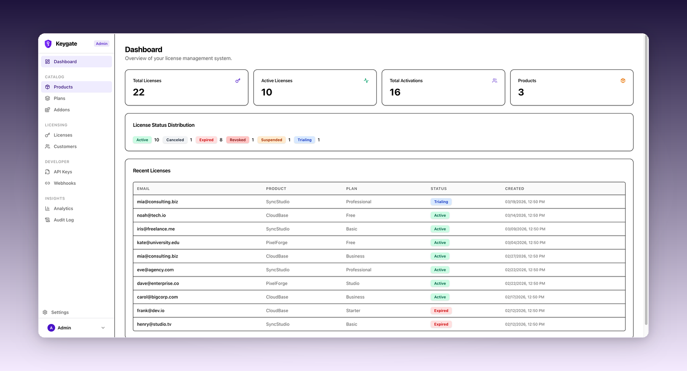

<div align="center">


# Keygate

**Open source software license management platform.**

The self-hosted alternative to Keygen, Cryptlex, and LicenseSpring.

[Website](https://keygate.app) · [Documentation](https://keygate.app/docs) · [Community](https://github.com/tabloy/keygate/discussions)

[](LICENSE)
[](https://github.com/tabloy/keygate/releases)
[](https://github.com/tabloy/keygate/stargazers)
[](https://keygate.app/sponsorships)

**[English](README.md)** · **[简体中文](README.zh-CN.md)**

<br />



</div>

<br />

## Why Keygate?

You've built great software. Now you need to decide who can use it, how they pay for it, and what features they get access to.

Commercial license platforms charge per-seat, per-month, and your customer data lives on someone else's servers. Building your own takes months of engineering on activation logic, payment webhooks, quota tracking, and all the edge cases that come at 2 AM.

**Keygate is the middle ground.** A production-ready license server you deploy on your own infrastructure, connect to your own Stripe, and manage through a clean dashboard. It handles everything from activation to dunning — so you can focus on building your product.

One binary. One database. Full control. Free, forever.

<br />

## Who is it for?

| | |
|:---|:---|
| **🧑‍💻 Indie Developers** — Selling a desktop app, CLI tool, or Electron app? Keygate handles license keys, activation limits, and trials so you can focus on shipping. | **🏢 SaaS Companies** — Managing subscription tiers with different feature sets? Define plans with entitlements, track usage, and let Stripe handle billing automatically. |
| **🏭 Enterprise Vendors** — Need floating licenses for large teams? Concurrent seat checkout with heartbeat monitoring, perfect for shared-seat environments. | **⚡ API Providers** — Enforcing rate limits and usage quotas? Atomic quota enforcement tracks every call and warns customers before they hit limits. |

<br />

## Features

### 🔑 License Management

Every model in one platform — **subscriptions**, **perpetual**, **trials**, and **floating** (concurrent) licenses. Create, activate, verify, suspend, reinstate, and revoke with full audit trail. Per-device or per-user activation limits with **atomic enforcement** (no double-counting under retry). Grace periods. License keys hashed with SHA-256, encrypted at rest. Signed tokens for offline verification. **`Idempotency-Key` header** support on writes — retries never duplicate.

Public SDK endpoints (activate / verify / deactivate / usage / download) take `license_key` directly — no embedded API keys to leak from your binaries. Customers can self-serve activation slots from the portal (free up a lost laptop without a support ticket).

### 🚀 Software Distribution

Ship signed updates to your installed clients. **Sparkle** (macOS), **Velopack** (Windows), and **Tauri** (cross-platform) updaters all consume the same release feed — one publish, every updater compatible. Per-platform binaries grouped under a single release, **atomic publish gate** (no half-uploaded releases ever leak), **yank** for instant rollback. Per-product **Ed25519 signing keys** with private keys encrypted at rest under AES-256-GCM + HKDF-derived subkeys. Server-side SHA-256 for integrity (never trust the client's hash). Stable feeds are public — your customers' auto-updater never breaks when a license rotates. Per-product `minimum_supported_version` floor for forced upgrades.

Object storage is S3-compatible — Cloudflare R2, AWS S3, MinIO, anything that speaks SigV4. Presigned URLs for direct browser upload (no proxying through Keygate), and license-gated short-TTL download URLs.

### 📊 Usage Metering

Track API calls, storage, bandwidth, or any custom metric. Quotas enforced **atomically at the database level** — even under high concurrency, limits are never exceeded. Hourly, daily, monthly, or yearly cycles with automatic reset. Threshold warnings via webhooks.

### 💳 Payments

Stripe integrated end-to-end with **three-layer reliability** — webhook, success-page verification, and periodic sync ensure no payment is ever missed. Customer pays → license created automatically. Payment fails → dunning emails on schedule. Supports checkout, plan upgrades/downgrades with proration, cancellations, refunds, and billing portal. Stripe webhook is auto-configured — just set your API key.

### 👥 Team Seats & Entitlements

Customers manage their own teams within a license. Seat roles (owner/admin/member), configurable limits per plan. Feature entitlements as boolean flags, numeric limits, or usage quotas. Purchasable add-ons that extend plan capabilities.

### 🔧 Server-to-Server API

Programmatic admin access via `Authorization: Bearer kg_live_…` — mint licenses from your Stripe webhook, run nightly usage exports from cron, automate everything `/admin/*` can do. **Scope-based authorization** with fail-closed defaults (an API key with no scopes can do nothing). System-wide admin keys or per-product keys — same model as Stripe `sk_live_` and GitHub PATs.

### 📈 Admin Dashboard

Products, plans, licenses, customers, API keys, webhooks, analytics, audit logs, team management, email templates, and brand customization — all from one interface. Search, filter, and export (CSV/JSON).

### 🛡️ Security

Email OTP login with constant-time hash verification, role-based access checked per-request from database, brute-force protection, rate limiting, HMAC-signed webhooks, SameSite cookies, HSTS, and startup validation that rejects weak secrets. License verify endpoints collapse all "license-knowable" failures to a single 404 so `license_key` enumeration is closed off. Idempotency-Key middleware prevents double-execution on retried writes.

### 🌍 Self-Hosted

Single Go binary + PostgreSQL + (optional) S3-compatible storage for release artifacts. No Redis, no microservices. Auto-migration on startup. Setup wizard for first run. Custom branding, email templates, and i18n (English/Chinese/Turkish built-in).

<br />

## Quick Start

### Docker (recommended)

```bash
# 1. Download
curl -O https://raw.githubusercontent.com/tabloy/keygate/main/docker-compose.yml
curl -O https://raw.githubusercontent.com/tabloy/keygate/main/.env.example
cp .env.example .env

# 2. Set your secrets
# Edit .env: set JWT_SECRET and LICENSE_SIGNING_KEY (openssl rand -hex 32)

# 3. Run
docker compose up -d
```

### From source

```bash
git clone https://github.com/tabloy/keygate.git
cd keygate && cp .env.example .env
make build && ./bin/keygate
```

Open **http://localhost:9000** — the setup wizard guides you from there.

> 📖 Full docs, deployment guides, and SDK examples at **[keygate.app/docs](https://keygate.app/docs)**

<br />

## Compared to Alternatives

| | **Keygate** | Keygen | Cryptlex | LicenseSpring |
|:---|:---:|:---:|:---:|:---:|
| Open source | **✅ AGPL v3** | Partial | ❌ | ❌ |
| Self-hosted | **✅** | ✅ | ❌ | ❌ |
| Price | **Free** | From $99/mo | From $249/mo | From $50/mo |
| Floating licenses | ✅ | ✅ | ✅ | ✅ |
| Usage metering | **✅** | ❌ | ❌ | ❌ |
| Built-in payments | **✅** | ❌ | ❌ | ❌ |
| Auto-update distribution | **✅ Sparkle / Velopack / Tauri** | ✅ Paid add-on | ❌ | ❌ |
| Customer portal | ✅ | ❌ | ✅ | ✅ |
| Admin dashboard | ✅ | ✅ | ✅ | ✅ |
| Webhook system | ✅ | ✅ | ✅ | ✅ |
| Audit trail | ✅ | ✅ | ❌ | ❌ |
| Idempotency-Key | **✅** | ❌ | ❌ | ❌ |
| i18n | ✅ | ❌ | ❌ | ❌ |

<br />

## Community

- **[Discussions](https://github.com/tabloy/keygate/discussions)** — Questions, ideas, show & tell
- **[Issues](https://github.com/tabloy/keygate/issues)** — Bug reports and feature requests
- **[Blog](https://keygate.app/blog)** — Updates and engineering stories
- **[Sponsor](https://keygate.app/sponsorships)** — Support the project

## Contributing

All contributions welcome — bugs, features, docs, translations. Check [open issues](https://github.com/tabloy/keygate/issues) or start a [discussion](https://github.com/tabloy/keygate/discussions), then submit a PR.

## License

[AGPL v3 License](LICENSE) with additional terms per [Section 7(b)](https://www.gnu.org/licenses/agpl-3.0.en.html#section7) — Copyright © 2026 [Tabloy](https://tabloy.app)

You are free to fork, modify, and self-host this software under the AGPL v3. The **"Powered by Keygate"** attribution in the UI must be preserved (see [NOTICE](NOTICE)). A commercial license to remove the attribution is available — contact [hello@keygate.app](mailto:hello@keygate.app).

## Star History

<a href="https://star-history.com/#tabloy/keygate&Date">
 <picture>
   <source media="(prefers-color-scheme: dark)" srcset="https://api.star-history.com/svg?repos=tabloy/keygate&type=Date&theme=dark" />
   <source media="(prefers-color-scheme: light)" srcset="https://api.star-history.com/svg?repos=tabloy/keygate&type=Date" />
   
 </picture>
</a>

---

<div align="center">
<sub>If Keygate helps your business, consider giving it a ⭐</sub>
</div>
