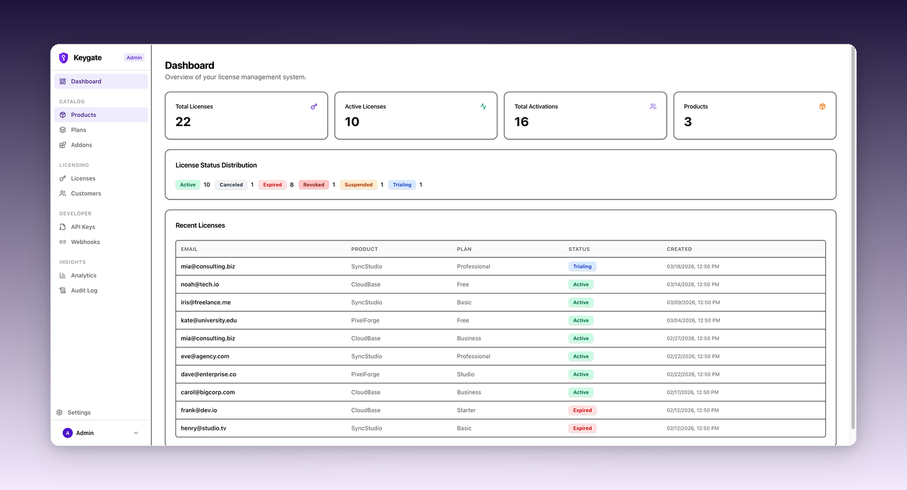

<div align="center">


# Keygate

**开源软件许可证管理平台。**

可自托管的 Keygen、Cryptlex、LicenseSpring 替代方案。

[官网](https://keygate.app) · [文档](https://keygate.app/docs) · [社区](https://github.com/tabloy/keygate/discussions)

[](LICENSE)
[](https://github.com/tabloy/keygate/releases)
[](https://github.com/tabloy/keygate/stargazers)
[](https://keygate.app/sponsorships)

**[English](README.md)** · **[简体中文](README.zh-CN.md)**

<br />



</div>

<br />

## 为什么选择 Keygate？

你做了一款出色的软件。现在需要决定谁能用它、怎么收费、以及开放哪些功能。

商业许可证平台按席位、按月收费，而且你的客户数据存储在别人的服务器上。自己开发一套需要数月的工程投入 — 激活逻辑、支付回调、配额追踪，还有凌晨两点出现的各种边界情况。

**Keygate 是两者之间的最优解。** 一个生产就绪的许可证服务器，部署在你自己的基础设施上，接入你自己的 Stripe 或 PayPal，通过简洁的管理后台统一管理。从激活到催款，全部搞定 — 让你专注于构建产品。

一个二进制文件。一个数据库。完全掌控。永久免费。

<br />

## 适合谁？

| | |
|:---|:---|
| **🧑‍💻 独立开发者** — 在卖桌面应用、CLI 工具或 Electron 应用？Keygate 帮你管理许可证密钥、激活限制和试用期，让你专注发布新功能。 | **🏢 SaaS 公司** — 需要管理不同功能集的订阅层级？定义计划和权限，追踪用量，让 Stripe 自动处理计费。 |
| **🏭 企业软件厂商** — 需要为大团队提供浮动许可？并发席位签出配合心跳监控，完美适配共享席位场景。 | **⚡ API 服务商** — 需要执行速率限制和用量配额？原子级配额执行追踪每一次调用，在客户达到限额前发出预警。 |

<br />

## 功能特性

### 🔑 许可证管理

一个平台覆盖所有模式 — **订阅制**、**永久买断**、**免费试用**和**浮动许可**（并发）。创建、激活、验证、暂停、恢复和吊销，全程审计追踪。按设备或按用户的激活限制。宽限期。许可证密钥用 SHA-256 哈希存储。HMAC-SHA256 签名 token 支持离线验证。

### 📊 用量计量

追踪 API 调用次数、存储空间、带宽或任何自定义指标。配额在**数据库层原子执行** — 即使在高并发下也不会超限。支持小时、天、月、年周期，自动重置。通过 Webhook 发送阈值预警。

### 💳 支付集成

Stripe 和 PayPal 端到端集成。客户付款 → 许可证自动创建。付款失败 → 按计划发送催款邮件。支持结账、升降级（按比例计费）、取消、退款和账单管理门户。

### 👥 团队席位与权限

客户在许可证内管理自己的团队。席位角色（所有者/管理员/成员），每个计划可配置上限。功能权限支持布尔标志、数值限制或用量配额。可购买的附加组件扩展计划能力。

### 📈 管理后台

产品、计划、许可证、客户、API 密钥、Webhook、分析、审计日志、团队管理、邮件模板和品牌自定义 — 全部在一个界面完成。搜索、筛选和导出（CSV/JSON）。

### 🛡️ 安全

OAuth2 登录（GitHub/Google），基于数据库的每次请求角色权限检查，暴力破解防护，速率限制，HMAC 签名 Webhook，SameSite Cookie，HSTS，启动时拒绝弱密钥。

### 🌍 自托管

单个 Go 二进制文件 + PostgreSQL。无需 Redis，无需微服务。启动时自动迁移。首次运行有安装向导。支持自定义品牌、邮件模板和国际化（内置中英文）。

<br />

## 快速开始

### Docker（推荐）

```bash
# 1. 下载
curl -O https://raw.githubusercontent.com/tabloy/keygate/main/docker-compose.yml
curl -O https://raw.githubusercontent.com/tabloy/keygate/main/.env.example
cp .env.example .env

# 2. 设置密钥
# 编辑 .env：设置 JWT_SECRET 和 LICENSE_SIGNING_KEY（openssl rand -hex 32）

# 3. 启动
docker compose up -d
```

### 从源码构建

```bash
git clone https://github.com/tabloy/keygate.git
cd keygate && cp .env.example .env
make build && ./bin/keygate
```

打开 **http://localhost:9000** — 安装向导会引导你完成初始配置。

> 📖 完整文档、部署指南和 SDK 示例请访问 **[keygate.app/docs](https://keygate.app/docs)**

<br />

## 与竞品对比

| | **Keygate** | Keygen | Cryptlex | LicenseSpring |
|:---|:---:|:---:|:---:|:---:|
| 开源 | **✅ AGPL v3** | 部分 | ❌ | ❌ |
| 可自托管 | **✅** | ✅ | ❌ | ❌ |
| 价格 | **免费** | $99/月起 | $249/月起 | $50/月起 |
| 浮动许可 | ✅ | ✅ | ✅ | ✅ |
| 用量计量 | **✅** | ❌ | ❌ | ❌ |
| 内置支付 | **✅** | ❌ | ❌ | ❌ |
| 客户门户 | ✅ | ❌ | ✅ | ✅ |
| 管理后台 | ✅ | ✅ | ✅ | ✅ |
| Webhook | ✅ | ✅ | ✅ | ✅ |
| 审计日志 | ✅ | ✅ | ❌ | ❌ |
| 多语言 | ✅ | ❌ | ❌ | ❌ |

<br />

## 社区

- **[讨论区](https://github.com/tabloy/keygate/discussions)** — 提问、分享想法
- **[Issues](https://github.com/tabloy/keygate/issues)** — Bug 报告和功能请求
- **[博客](https://keygate.app/blog)** — 产品更新和技术文章
- **[赞助](https://keygate.app/sponsorships)** — 支持项目发展

## 贡献

欢迎所有形式的贡献 — Bug 修复、新功能、文档改进、翻译等。查看 [open issues](https://github.com/tabloy/keygate/issues) 或发起 [讨论](https://github.com/tabloy/keygate/discussions)，然后提交 PR。

## 许可证

[AGPL v3 License](LICENSE)（附 [Section 7(b)](https://www.gnu.org/licenses/agpl-3.0.en.html#section7) 附加条款）— Copyright © 2026 [Tabloy](https://tabloy.app)

你可以在 AGPL v3 下自由 fork、修改和自托管本软件。UI 中的 **"Powered by Keygate"** 署名须保留（详见 [NOTICE](NOTICE)）。如需移除署名，可购买商业许可 — 联系 [hello@keygate.app](mailto:hello@keygate.app)。

## Star 趋势

<a href="https://star-history.com/#tabloy/keygate&Date">
 <picture>
   <source media="(prefers-color-scheme: dark)" srcset="https://api.star-history.com/svg?repos=tabloy/keygate&type=Date&theme=dark" />
   <source media="(prefers-color-scheme: light)" srcset="https://api.star-history.com/svg?repos=tabloy/keygate&type=Date" />
   
 </picture>
</a>

---

<div align="center">
<sub>如果 Keygate 对你的业务有帮助，请给我们一个 ⭐</sub>
</div>
